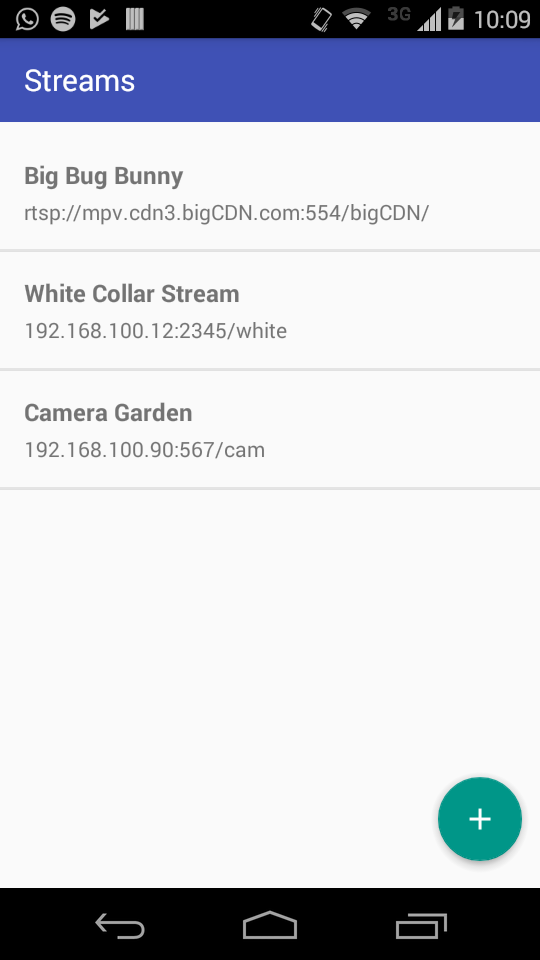
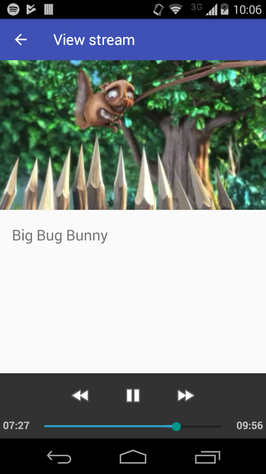

# RTSP Viewer
Stores and play a collection of RTSP streams




### For developers
If you want to play RTSP streams in your own app, you should check the `PlayerFragment`.

Basically all you have to do is to set a RTSP url to `VideoView` and start playback
```java
// Configure media controller
MediaController mediaController = new MediaController(getContext());
mediaController.setAnchorView(viewBinding.vvPlayer);
mediaController.setMediaPlayer(viewBinding.vvPlayer);

// Configure video view to fetch stream
viewBinding.vvPlayer.setMediaController(mediaController);
viewBinding.vvPlayer.setVideoURI(liveStreamUri);
viewBinding.vvPlayer.start();
```
